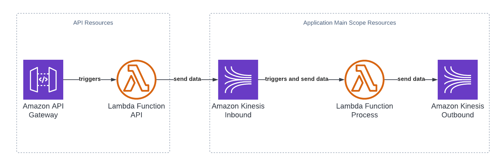

# Kinesis Stream with Lambda and API
Project that creates an API using lambda and API Gateway, recieve data from user, checks if the field 'user_timespent' is correct (not 0 or nullable) and send the data to the Inboud Kinesis (sender) that triggers a process lambda function which decodes the base64 data and send it to the Outbound Kinesis (reciever).

## Files Description
  - cloudformation
    - cf_main_scope.yaml: CloudFormation template that provides all of the infrastrucure that is required for running the application. It provides the API Gateway configs, the lambdas, Inbound Kinesis, Outbound Kinesis and Roles with policies to allow the necessary permissions. All of the lambda codes are already in the CloudFormation so it is not necessary to zip everthing and upload on a AWS S3 Bucket.
  - src: Lambda codes
    - api_lambda.py
    - process_lambda.py
 
 ## How to use it 
 You can upload the yaml code in the console in AWS CloudFormation or run the command line (make sure you are logged in your profile): 
 ``` 
 aws cloudformation deploy --template-file /path_to_template/cf_main_scope.yaml --stack-name kinesis-lambda
 ```
 In case of any doubt see the [AWS CloudFormation Documentation](https://docs.aws.amazon.com/cli/latest/reference/cloudformation/deploy/index.html).
 
 ## Application Diagram
 
